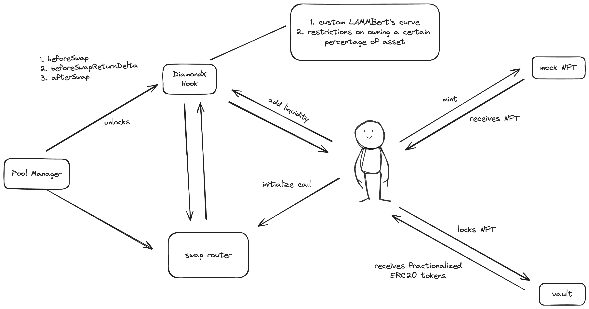

# DiamondX - Bringing Liquidity to Real-World Assets

## Introduction

Welcome to DiamondX, a revolutionary system that bridges the gap between real-world assets (RWA) and decentralized finance (DeFi). Our platform aims to provide a seamless integration of diamonds into the DeFi ecosystem, allowing users to leverage the liquidity of Uniswap through an innovative combination of CPMM and CSMM mechanisms.

## Overview

Diamonds vary greatly in rarity and volatility, and our system is designed to handle these variations efficiently. By using a dynamic approach, we ensure optimal liquidity provision and stability for both volatile and non-volatile diamonds.

### Key Features

1. **Combination of CPMM and CSMM**:

   - For volatile diamonds, we use Constant Product Market Maker (CPMM).
   - For non-volatile diamonds, we use Constant Sum Market Maker (CSMM).
   - This dynamic approach is powered by our custom LAMMBert AMM curve.

2. **Dynamic Fee System**:

   - Our platform incorporates a dynamic fee structure to enhance functionality and incentivize liquidity providers.

3. **Fractional Ownership**:
   - Diamonds are fractionalized into smaller units to make them accessible to a broader audience.
   - Custom checks ensure no single entity can own an entire diamond, though this restriction can be adjusted when necessary.

## Workflow

1. **Verification**:

   - Diamonds are verified by trusted off-chain parties.

2. **NFT Conversion**:

   - Verified diamonds are converted into NFTs which are managed by our platform.

3. **NFT Locking**:

   - The diamond NFTs are locked into a secure vault.

4. **ERC20 Token Creation**:

   - The vault generates ERC20 tokens corresponding to the diamond NFTs.

5. **Liquidity Provision**:
   - Liquidity providers (LPs) can supply liquidity using our custom curve implementation via a hook.

## Technical Details

### LAMMBert AMM Custom Curve

...

- **CPMM**: Suitable for volatile assets, ensuring continuous liquidity.
- **CSMM**: Ideal for stable assets, maintaining price stability.

### Dynamic Fee Structure

The dynamic fee system adjusts based on market conditions and user activity, ensuring fair and efficient transactions.

### Fractionalization and Ownership Checks

Diamonds are extremely valuable, so we fractionalize ownership to lower the entry barrier. Our system includes custom checks to prevent monopolization of any single diamond, which can be overridden if necessary.

### Uniswap v4 Hooks Integration

Leveraging Uniswap v4 hooks, we provide:

- **Custom Trading Rules**: Tailored to the specific requirements of the diamond market.
- **Compliance and Security**: Ensuring adherence to regulations and enhancing security through custom hooks.
- **Seamless User Experience**: Users interact with fractionalized tokens without additional complexity, thanks to behind-the-scenes custom logic.

## Customization Hub

Our platform also includes a Customization Hub, allowing developers to implement proprietary functions and applications tailored to the needs of each RWA use case. This hub ensures flexibility and scalability, enabling developers to create bespoke solutions for various industries.

## How to Use

1. **Diamond Verification**: Submit your diamond for verification through our trusted off-chain partners.
2. **NFT Management**: Once verified, your diamond is converted into an NFT and locked in our vault.
3. **Token Creation**: The vault issues ERC20 tokens for your diamond NFT.
4. **Provide Liquidity**: Use our hook to provide liquidity on Uniswap with the newly created ERC20 tokens.
